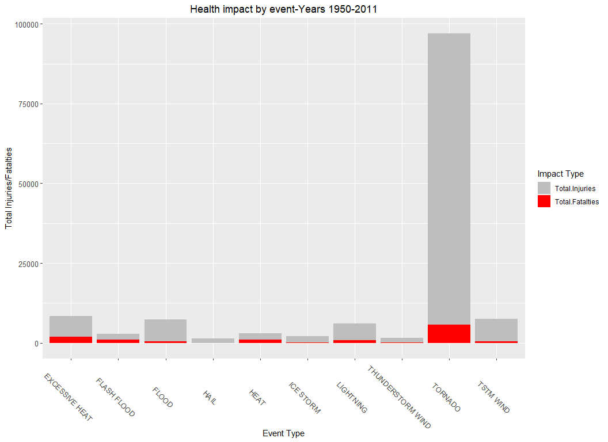
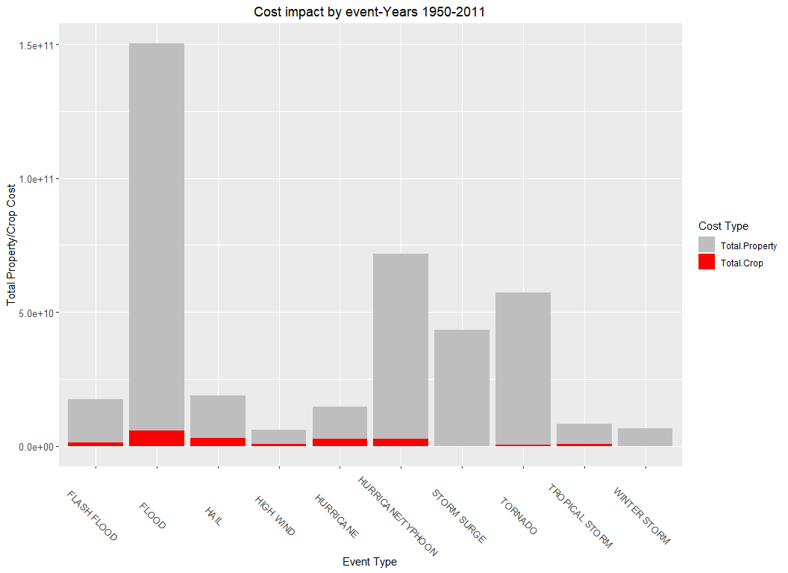

# Synopsis
The purpose of this research project is to asses the impact of wheater events on public health and the economy.
Using the NOAA Storm Database, which contains data from the years 1950-2011 about wheater events, Property and Crop cost damage as well as numbers of injuries and fatalities in the US.
The research aim is to find out the most impact events in term of economic (cost), and public health (number of injuries and fatalities).

# Data Processing

### Load the Data Set
Download the files and unzip them into a data directory. 

#### Load R libreries 


```r
if(!file.exists("data")) {  
        dir.create("data")  
}  
if(!file.exists("./data/StormData.csv.bz2")) {  
        fileUrl <- "https://d396qusza40orc.cloudfront.net/repdata%2Fdata%2FStormData.csv.bz2"  
        download.file(fileUrl, destfile="./data/StormData.csv.bz2")  
        if(!file.exists("./data/StormData.csv"))   
                bunzip2("./data/StormData.csv.bz2", "./data/StormData.csv", remove = FALSE, skip = TRUE) 
}
StormsData<-read.csv("./data/StormData.csv")
```

### Initial review 
Look on the dimansion of the data 

```r
dim(StormsData)
```

```
## [1] 902297     37
```


using str looking on the dataset 

```r
names(StormsData)
```

```
##  [1] "STATE__"    "BGN_DATE"   "BGN_TIME"   "TIME_ZONE"  "COUNTY"    
##  [6] "COUNTYNAME" "STATE"      "EVTYPE"     "BGN_RANGE"  "BGN_AZI"   
## [11] "BGN_LOCATI" "END_DATE"   "END_TIME"   "COUNTY_END" "COUNTYENDN"
## [16] "END_RANGE"  "END_AZI"    "END_LOCATI" "LENGTH"     "WIDTH"     
## [21] "F"          "MAG"        "FATALITIES" "INJURIES"   "PROPDMG"   
## [26] "PROPDMGEXP" "CROPDMG"    "CROPDMGEXP" "WFO"        "STATEOFFIC"
## [31] "ZONENAMES"  "LATITUDE"   "LONGITUDE"  "LATITUDE_E" "LONGITUDE_"
## [36] "REMARKS"    "REFNUM"
```
### Processing
Create a subset data frame which will use the relevant variables only: 
EVTYPE - The Event type as is 
BGN_TIME - This is the exact begin time, it will be used to extract the year of the event
PROPDMG - Property Damage cost 
PROPDMGEXP - Property Damage Cost Factor (K-1000,M-1000000,B-1000000000)
CROPDMG - Crop Damage cost 
CROPDMGEXP-Crop Damage Cost Factor (K-1000,M-1000000,B-1000000000)
FATALITIES - Number of deaths
INJURIES - Number of injuries 


```r
StormDF<-data.frame(Event.Type=StormsData$EVTYPE)
```

The data analyzed will be based on years - Create a new column, which will have the beginning year of the event
Use the BGN_TIME to extract the years.

```r
StormDF<-cbind(StormDF,years = with(StormsData,format(as.Date(BGN_DATE, format="%m/%d/%Y"),"%Y")))
```

Add the Fatalities and injuries columns as is. 

```r
Fatalities.No<-StormsData$FATALITIES

Injuries.No<-StormsData$INJURIES

StormDF<-cbind(StormDF,data.frame(Fatalities.No))

StormDF<-cbind(StormDF,data.frame(Injuries.No))
```

Add the Damage Columns using the PROPDMG, PROPDMGEXP CROPDMG, and the CROPDMGEXP 
Create a Dameg.cost function , based on the values from PROPDMG multiple by 
Different factors (K - 1000 , M - 1000000 , B - 1000000000)
Any other value assumes error and put zero Add the Fatalities and injuries columns as is. 

```r
#Copy the Two Damage Columns to the new DataFrame
StormDF$Property.Damage.Cost<-StormsData$PROPDMG
StormDF$Property.Damage.Factor<-StormsData$PROPDMGEXP
# Build a new Column with (K - 1000 , M - 1000000 , B - 1000000000)
#Any other value assume error and put zero 
StormDF<-StormDF %>%  
      mutate(Property.Damage.Cost.Factor = as.numeric(case_when(
      Property.Damage.Factor =="K" ~ 1000,  Property.Damage.Factor =="M" ~ 1000000,
      Property.Damage.Factor =="B" ~ 1000000000,(Property.Damage.Factor !="M" |Property.Damage.Factor !="B" | Property.Damage.Factor !="K")~0)))
#Replace the Damage cost column with the the Damage.Cost * Damage.Cost.Factor
StormDF$Property.Damage.Cost<-StormDF$Property.Damage.Cost * StormDF$Property.Damage.Cost.Factor
#view how table of the cost factor 
table(StormDF$Property.Damage.Cost.Factor)
```

```
## 
##      0   1000  1e+06  1e+09 
## 466262 424665  11330     40
```

```r
#remove the temporary columns
StormDF<-select(StormDF,Event.Type,years,Fatalities.No,Injuries.No,Property.Damage.Cost)
head(StormDF)
```

```
##   Event.Type years Fatalities.No Injuries.No Property.Damage.Cost
## 1    TORNADO  1950             0          15                25000
## 2    TORNADO  1950             0           0                 2500
## 3    TORNADO  1951             0           2                25000
## 4    TORNADO  1951             0           2                 2500
## 5    TORNADO  1951             0           2                 2500
## 6    TORNADO  1951             0           6                 2500
```
Create a Crop.Dameg.cost function, based on the values from CROPDMG multiple by 
Different factors (K - 1000 , M - 1000000 , B - 1000000000)
Any other value assume error and put zero 

```r
#Copy the Two CROP Damage Columns to the new DataFrame
StormDF$Crop.Damage.Cost<-StormsData$CROPDMG
StormDF$Crop.Damage.Factor<-StormsData$CROPDMGEXP
# Build a new Column with (K - 1000 , M - 1000000 , B - 1000000000)
#Any other value assume error and put zero 
StormDF<-StormDF %>%  
      mutate(Crop.Damage.Cost.Factor = as.numeric(case_when(
      Crop.Damage.Factor =="K" ~ 1000,  Crop.Damage.Factor =="M" ~ 1000000,
      Crop.Damage.Factor =="B" ~ 1000000000,(Crop.Damage.Factor !="M" |Crop.Damage.Factor !="B" | Crop.Damage.Factor !="K")~0)))
#REplace the Damage cost column with the the Damage.Cost * Damage.Cost.Factor
StormDF$Crop.Damage.Cost<-StormDF$Crop.Damage.Cost * StormDF$Crop.Damage.Cost.Factor
#view how table of the cost factor 
table(StormDF$Crop.Damage.Cost.Factor)
```

```
## 
##      0   1000  1e+06  1e+09 
## 618462 281832   1994      9
```

```r
#remove the temporary columns
StormDF<-select(StormDF,Event.Type,years,Fatalities.No,Injuries.No,Property.Damage.Cost,Crop.Damage.Cost)
head(StormDF)
```

```
##   Event.Type years Fatalities.No Injuries.No Property.Damage.Cost
## 1    TORNADO  1950             0          15                25000
## 2    TORNADO  1950             0           0                 2500
## 3    TORNADO  1951             0           2                25000
## 4    TORNADO  1951             0           2                 2500
## 5    TORNADO  1951             0           2                 2500
## 6    TORNADO  1951             0           6                 2500
##   Crop.Damage.Cost
## 1                0
## 2                0
## 3                0
## 4                0
## 5                0
## 6                0
```

create aggrgaition data per Fatalties numbers per even.

```r
#Aggrgate based on Event Type - All years 1950 - 2011
Fatalities<-aggregate(StormDF$Fatalities.No,by=list(Category=StormDF$Event.Type),sum)

Fatalities$Type<-"Fatlity"

colnames(Fatalities)<-c("Event.Type","Total","Type")

Fatalities<-Fatalities[order(Fatalities$Total, decreasing = T), ]
```


create aggrgaition data per Injuries numbers per event type. 

```r
#Aggrgate based on Event Type 
Injuries<-aggregate(StormDF$Injuries.No,by=list(Category=StormDF$Event.Type),sum)

Injuries$Type<-"Injury"

colnames(Injuries)<-c("Event.Type","Total","Type")

Injuries<-Injuries[order(Injuries$Total, decreasing = T), ]
```


Create a combined data frame for injury and fatalities to create the overall population health impact
for all years (1950-2011), Select top 10.
Using join as it keep the order of the two joined Data Frame.

```r
Health<-join(Injuries,Fatalities,by="Event.Type",type="inner")
#subset by top 10
Health<-head(Health,10)

head(Health)
```

```
##       Event.Type Total   Type Total    Type
## 1        TORNADO 91346 Injury  5633 Fatlity
## 2      TSTM WIND  6957 Injury   504 Fatlity
## 3          FLOOD  6789 Injury   470 Fatlity
## 4 EXCESSIVE HEAT  6525 Injury  1903 Fatlity
## 5      LIGHTNING  5230 Injury   816 Fatlity
## 6           HEAT  2100 Injury   937 Fatlity
```


create aggrgaition data per Proprety Damage cost per event type . 

```r
#Aggrgate based on Event Type 
Cost.Property.Damage<-aggregate(StormDF$Property.Damage.Cost,by=list(Category=StormDF$Event.Type),sum)

Cost.Property.Damage$Type<-"Property"

colnames(Cost.Property.Damage)<-c("Event.Type","Cost","Type")

Cost.Property.Damage<-Cost.Property.Damage[order(Cost.Property.Damage$Cost, decreasing = T), ]
```

create aggrgaition data per Crop Damage cost per event type .

```r
#Aggrgate based on Event Type 
Cost.Crop.Damage<-aggregate(StormDF$Crop.Damage.Cost,by=list(Category=StormDF$Event.Type),sum)

Cost.Crop.Damage$Type<-"Crop"

colnames(Cost.Crop.Damage)<-c("Event.Type","Cost","Type")

Cost.Crop.Damage<-Cost.Crop.Damage[order(Cost.Crop.Damage$Cost, decreasing = T), ]
```


Create a combined data frame for Crop and Damage cost to create the overall Cost impact
for all years (1950-2011) select top 10.
Using join as it keep the order of the two joined Data Frame.

```r
Cost<-join(Cost.Property.Damage,Cost.Crop.Damage,by="Event.Type",type="inner")
#Subset by top 10
Cost<-head(Cost,10)

head(Cost)
```

```
##          Event.Type         Cost     Type       Cost Type
## 1             FLOOD 144657709800 Property 5661968450 Crop
## 2 HURRICANE/TYPHOON  69305840000 Property 2607872800 Crop
## 3           TORNADO  56925660480 Property  414953110 Crop
## 4       STORM SURGE  43323536000 Property       5000 Crop
## 5       FLASH FLOOD  16140811510 Property 1421317100 Crop
## 6              HAIL  15727366720 Property 3025537450 Crop
```


# Results 
This section contains the answares to the two questions:
1.Across the United States, which types of events (as indicated in the EVENT TYPE variable) are most harmful with respect to population health?
Across the United States, which types of events have the greatest economic consequences?

## Harmfull events - Population Health 
Plot the top 10 combined injuries and fatalities events for  1950-2011 
Using the melt function (reshape2 library) organize the data to allow plotting at the same panel.

```r
colnames(Health)<-c("Event.Type","Total.Injuries","Type.Injuries","Total.Fatalties","Type.Fatalties")

Health_long <- melt(Health, id.vars = c("Event.Type","Type.Injuries","Type.Fatalties"))

theme_update(plot.title = element_text(hjust = 0.5))

ggplot(data=Health_long,aes(x=Event.Type, y=value, fill=variable)) +
            geom_bar(stat="identity",position ="stack") +theme(axis.text.x = element_text(size = 10,angle = -45))+labs(y="Total Injuries/Fatalties",x = "Event Type", title = "Health impact by event-Years 1950-2011",size=12)+scale_fill_manual("Impact Type", values = c("Total.Injuries" = "gray", "Total.Fatalties" = "red",size=12))+theme(axis.text.y.left =   element_text(size = 10))+theme(axis.text.y.right =  element_text(size = 10))
```

<!-- -->


## Harmfull events - Cost Impact
Plot the top 10 combined injuries and fatalities events for  1950-2011  
sing the melt function (reshape2 library) organize the data to allow plotting at the same panel.

```r
colnames(Cost)<-c("Event.Type","Total.Property","Type.Property","Total.Crop","Type.Crop")

Cost_long <- melt(Cost, id.vars = c("Event.Type","Type.Property","Type.Crop"))

theme_update(plot.title = element_text(hjust = 0.5))

ggplot(data=Cost_long,aes(x=Event.Type, y=value, fill=variable)) +
   geom_bar(stat="identity",position ="stack") +theme(axis.text.x = element_text(size = 10,angle = -45))+labs(y="Total Property/Crop Cost",x = "Event Type", title = "Cost impact by event-Years 1950-2011")+scale_fill_manual("Cost Type", values = c("Total.Property" = "gray", "Total.Crop" = "red",size=10))+theme(axis.text.y.left =   element_text(size = 10))+theme(axis.text.y.right =  element_text(size = 10))
```

<!-- -->

# Conclousion
When analyzing the two plots it can be seen that for economic impact the most harmful events are floods, regarding public health, the most harmful event is Tornado.
We can also see that regarding the economic impact the property damages are more significant then crop damages costs.
