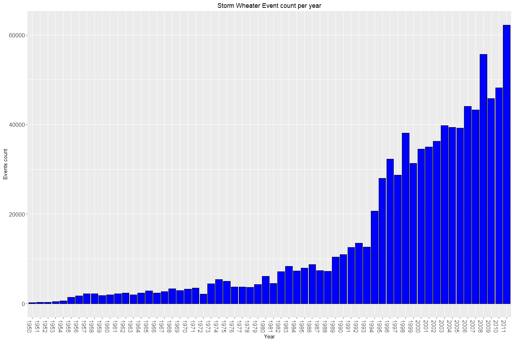

# Synopsis

# Data Processing

### Load the Data Set
Download the files and unzip them into a data directory. 

#### Load R libreries 


```r
if(!file.exists("data")) {  
        dir.create("data")  
}  
if(!file.exists("./data/StormData.csv.bz2")) {  
        fileUrl <- "https://d396qusza40orc.cloudfront.net/repdata%2Fdata%2FStormData.csv.bz2"  
        download.file(fileUrl, destfile="./data/StormData.csv.bz2")  
        if(!file.exists("./data/StormData.csv"))   
                bunzip2("./data/StormData.csv.bz2", "./data/StormData.csv", remove = FALSE, skip = TRUE) 
}
StormsData<-read.csv("./data/StormData.csv")
```

### Initial review  

```r
dim(StormsData)
```

```
## [1] 902297     37
```


using str looking on the dataset 

```r
names(StormsData)
```

```
##  [1] "STATE__"    "BGN_DATE"   "BGN_TIME"   "TIME_ZONE"  "COUNTY"    
##  [6] "COUNTYNAME" "STATE"      "EVTYPE"     "BGN_RANGE"  "BGN_AZI"   
## [11] "BGN_LOCATI" "END_DATE"   "END_TIME"   "COUNTY_END" "COUNTYENDN"
## [16] "END_RANGE"  "END_AZI"    "END_LOCATI" "LENGTH"     "WIDTH"     
## [21] "F"          "MAG"        "FATALITIES" "INJURIES"   "PROPDMG"   
## [26] "PROPDMGEXP" "CROPDMG"    "CROPDMGEXP" "WFO"        "STATEOFFIC"
## [31] "ZONENAMES"  "LATITUDE"   "LONGITUDE"  "LATITUDE_E" "LONGITUDE_"
## [36] "REMARKS"    "REFNUM"
```
### Processing
Create a subset data frame which will use the relvanet variables 
EVTYPE - The Event type as is 


```r
StormDF<-data.frame(Event.Type=StormsData$EVTYPE)
```

The data analyze will be based on years - Create a new column , which will have the begin year of the event
Use the BGN_TIME to extract the years

```r
StormDF<-cbind(StormDF,years = with(StormsData,format(as.Date(BGN_DATE, format="%m/%d/%Y"),"%Y")))
```

Add the Fatalities and injuries columns as is  

```r
Fatalities.No<-StormsData$FATALITIES
Injuries.No<-StormsData$INJURIES
StormDF<-cbind(StormDF,data.frame(Fatalities.No))
StormDF<-cbind(StormDF,data.frame(Injuries.No))
```
Add the Damage Columns using the PROPDMG, PROPDMGEXP CROPDMG and the CROPDMGEXP 

Create a Dameg.cost function , based on the values from PROPDMG multiple by 
Diffrent factors (K - 1000 , M - 1000000 , B - 1000000000)
Any other value assume error and put zero 

```r
#Copy the Two Damage Columns to the new DataFrame
StormDF$Property.Damage.Cost<-StormsData$PROPDMG
StormDF$Property.Damage.Factor<-StormsData$PROPDMGEXP
# Build a new Column with (K - 1000 , M - 1000000 , B - 1000000000)
#Any other value assume error and put zero 
StormDF<-StormDF %>%  
      mutate(Property.Damage.Cost.Factor = as.numeric(case_when(
      Property.Damage.Factor =="K" ~ 1000,  Property.Damage.Factor =="M" ~ 1000000,
      Property.Damage.Factor =="B" ~ 1000000000,(Property.Damage.Factor !="M" |Property.Damage.Factor !="B" | Property.Damage.Factor !="K")~0)))
#REplace the Damage cost column with the the Damage.Cost * Damage.Cost.Factor
StormDF$Property.Damage.Cost<-StormDF$Property.Damage.Cost * StormDF$Property.Damage.Cost.Factor
#view how table of the cost factor 
table(StormDF$Property.Damage.Cost.Factor)
```

```
## 
##      0   1000  1e+06  1e+09 
## 466262 424665  11330     40
```

```r
#remove the temporary columns
StormDF<-select(StormDF,Event.Type,years,Fatalities.No,Injuries.No,Property.Damage.Cost)
head(StormDF)
```

```
##   Event.Type years Fatalities.No Injuries.No Property.Damage.Cost
## 1    TORNADO  1950             0          15                25000
## 2    TORNADO  1950             0           0                 2500
## 3    TORNADO  1951             0           2                25000
## 4    TORNADO  1951             0           2                 2500
## 5    TORNADO  1951             0           2                 2500
## 6    TORNADO  1951             0           6                 2500
```
Create a Crop.Dameg.cost function , based on the values from CROPDMG multiple by 
Diffrent factors (K - 1000 , M - 1000000 , B - 1000000000)
Any other value assume error and put zero 

```r
#Copy the Two CROP Damage Columns to the new DataFrame
StormDF$Crop.Damage.Cost<-StormsData$CROPDMG
StormDF$Crop.Damage.Factor<-StormsData$CROPDMGEXP
# Build a new Column with (K - 1000 , M - 1000000 , B - 1000000000)
#Any other value assume error and put zero 
StormDF<-StormDF %>%  
      mutate(Crop.Damage.Cost.Factor = as.numeric(case_when(
      Crop.Damage.Factor =="K" ~ 1000,  Crop.Damage.Factor =="M" ~ 1000000,
      Crop.Damage.Factor =="B" ~ 1000000000,(Crop.Damage.Factor !="M" |Crop.Damage.Factor !="B" | Crop.Damage.Factor !="K")~0)))
#REplace the Damage cost column with the the Damage.Cost * Damage.Cost.Factor
StormDF$Crop.Damage.Cost<-StormDF$Crop.Damage.Cost * StormDF$Crop.Damage.Cost.Factor
#view how table of the cost factor 
table(StormDF$Crop.Damage.Cost.Factor)
```

```
## 
##      0   1000  1e+06  1e+09 
## 618462 281832   1994      9
```

```r
#remove the temporary columns
StormDF<-select(StormDF,Event.Type,years,Fatalities.No,Injuries.No,Property.Damage.Cost,Crop.Damage.Cost)
head(StormDF)
```

```
##   Event.Type years Fatalities.No Injuries.No Property.Damage.Cost
## 1    TORNADO  1950             0          15                25000
## 2    TORNADO  1950             0           0                 2500
## 3    TORNADO  1951             0           2                25000
## 4    TORNADO  1951             0           2                 2500
## 5    TORNADO  1951             0           2                 2500
## 6    TORNADO  1951             0           6                 2500
##   Crop.Damage.Cost
## 1                0
## 2                0
## 3                0
## 4                0
## 5                0
## 6                0
```
Look at the nmumber of observiation per year ...
The assigment hints that the recent years have more data

```r
#Creat a data frame with the frequancy of each event per year
Event_Count<-count(StormDF,vars=c("years","Event.Type"))
Total_Event_PEr_Year<-data.frame(Event.Count = with(Event_Count,tapply(freq, years,sum)),Year = sort(unique(StormDF$years)))
```


Plot a bar plot of total events per year 1950-2011

```r
theme_update(plot.title = element_text(hjust = 0.5))
ggplot(data=Total_Event_PEr_Year, aes(x=Year, y=Event.Count)) +
    geom_bar(stat="identity",colour="black",fill="blue")+theme(axis.text.x = element_text(size = 12,angle = -90))+labs(y="Events count",x = "Year", title = "Storm Wheater Event count per year")+theme(axis.text.y = element_text(size = 12))
```

<!-- -->

The above plots show that starting from the year 1995 there is large amount of event data 
The analyzes will be based on the years 1995-2011
Subset the data in order to use data from years 1995 - 2011 


```r
#subset and create new data frame which include only the years 1995-2011
Year_1995_2011<-year(as.Date(StormDF$years, format = "%Y"))>=1995
StormDF_1995_2011<-filter(StormDF,Year_1995_2011)
```


create aggrgaition data per Fatalties numbers per event type and select the top 10 events 

```r
#Aggrgate based on Event Type 
Fatalities<-aggregate(StormDF_1995_2011$Fatalities.No,by=list(Category=StormDF_1995_2011$Event.Type),sum)
colnames(Fatalities)<-c("Event.Type","Fatalties")
Fatalities<-Fatalities[order(Fatalities$Fatalties, decreasing = T), ]
Fatalities<-Fatalities[1:10,]
```


create aggrgaition data per Injuries numbers per event type and select the top 10 events 

```r
#Aggrgate based on Event Type 
Injuries<-aggregate(StormDF_1995_2011$Injuries.No,by=list(Category=StormDF_1995_2011$Event.Type),sum)
colnames(Injuries)<-c("Event.Type","Injuries")
Injuries<-Injuries[order(Injuries$Injuries, decreasing = T), ]
Injuries<-Injuries[1:10,]
```


create aggrgaition data per Proprety Damage cost per event type and select the top 10 events 

```r
#Aggrgate based on Event Type 
Cost.Property.Damage<-aggregate(StormDF_1995_2011$Property.Damage.Cost,by=list(Category=StormDF_1995_2011$Event.Type),sum)
colnames(Cost.Property.Damage)<-c("Event.Type","Cost")
Cost.Property.Damage<-Cost.Property.Damage[order(Cost.Property.Damage$Cost, decreasing = T), ]
Cost.Property.Damage<-Cost.Property.Damage[1:10,]
```

create aggrgaition data per Crop Damage cost per event type and select the top 10 events 

```r
#Aggrgate based on Event Type 
Cost.Crop.Damage<-aggregate(StormDF_1995_2011$Crop.Damage.Cost,by=list(Category=StormDF_1995_2011$Event.Type),sum)
colnames(Cost.Crop.Damage)<-c("Event.Type","Cost")
Cost.Crop.Damage<-Cost.Crop.Damage[order(Cost.Crop.Damage$Cost, decreasing = T), ]
Cost.Crop.Damage<-Cost.Crop.Damage[1:10,]
```


# Results 
This section contains the answares to the two questions:
1.Across the United States, which types of events (as indicated in the EVENT TYPE variable) are most harmful with respect to population health?
Across the United States, which types of events have the greatest economic consequences?

## Harmfull events - Population Health 


